# SAFT-SF_automated_test_framework
Projeto base de framework para desenvolvimento de automação de testes WEB(Salesforce lightning) e APIs

<h4 align="center"> 
	🚧 Status do projeto 🚀 Em Testes...  🚧
</h4>

Tabela de conteúdos
=================
<!--ts-->
   * [Sobre](#Sobre)
   * [Tabela de Conteudo](#tabela-de-conteudo)
   * [Funcionalidades](#funcionalidades)
   * [Como usar](#como-usar)
      * [Pre Requisitos](#pré-requisitos)
      * [Rodando os testes](#-rodando-os-testes)
      * [Funções](#funções)
      * [Funções pré definidas](#funções-pré-definidas-do-gherkin)
      * [Funções personalizadas](#funções-simplificadas-e-personalizadas)
      * [Personalizar Codigo](#personalizar-codigo-para-teste)
   * [Tecnologias](#-tecnologias)
   * [Autoria](#autor)
<!--te-->

### Funcionalidades

- [x] Escrever testes usando apenas o Gherkin
- [x] Permite personalização de steps
- [x] Login com diferentes usuarios
- [x] Validação de mensagens de erro ou sucesso
- [x] Tratamento de erros padrão da plataforma, impedindo a falha precoce do teste
- [x] Navegação de registros
- [x] Navegação e objetos e Aplicativos Lightning
- [x] Criação de qualquer registro ou objeto
- [x] Edição de qualquer registro ou objeto
- [x] Percorrer fluxos funcionais de atendimento, logistica, gestão de estoque, etc...
- [x] Validação de qualquer valor de campo, usando regex ou valor assertivo
- [x] Simplifica o teste criado em 1 linha se necessario criar sub-fluxos ou pre-condições
- [ ] Geração de relatórios personalizados

## Como Usar:

### Pré-requisitos

Antes de começar, você vai precisar ter instalado em sua máquina as seguintes ferramentas:
- [Git](https://git-scm.com)
- [Java 1.8 ou superior](https://www.java.com/pt-BR/download/ie_manual.jsp?locale=pt_BR)
- Gerenciador de dependencias Maven: [Maven](https://maven.apache.org/)
- Para configurar o maven e o java, siga os passos do tutorial: [Tutorial Configuração](https://dicasdejava.com.br/como-instalar-o-maven-no-windows/)
- Além disto é bom ter uma IDE para trabalhar com o código como [Intellij](https://www.jetbrains.com/pt-br/idea/)

### 🎲 Rodando os testes:

- Baixe o conteudo desse repositorio para uma Workspace;
- Após criado seus testes no arquivo .feature, vá ate a classe RunTest.java e adicione a tag do seu teste e execute.

<h4 align="left"> Exemplo de tag:
  
</h4>
<h4 align="left"> Runtest com a tag para executar:
  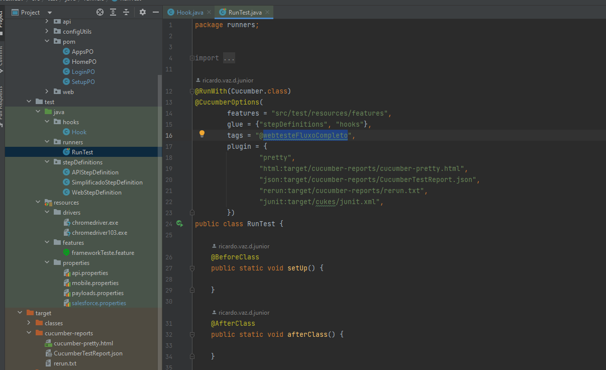
</h4>

## Funções

### Funções pré-definidas do Gherkin:

- Existem funções criadas previamente a partir do Gherkin para facilitar a criação de testes variados no Salesforce Lightning, listadas abaixo:

#### Funções de Wait e gravar variavel:

- <b>Given que o tempo de espera medio sera de 15 segundos</b> -> Define o tempo de espera padrão para encontrar cada elemento do teste, seja no background ou no teste especificado;
- <b>Given que a variavel "varNomeOportunidade" tenha o valor "oportunidade Random"</b> -> Cria uma variavel a partir do valor desejado, qualquer valor que contenha a palavra "Random" vai ser randomizado em um hexadecimal de 5 caracteres;

#### Função de login:

- <b> And que esteja logado no SalesForce com sucesso com o usuario "Gerente"</b> -> Faz o login no salesforce que foi definido no arquivo salesforce.properties junto com as credenciais, devendo elas serem nomeadas da seguinte forma seguindo o exemplo de "Gerente": usernameGerente=valor, passwordGerente=valor
<h4 align="left"> Arquivo properties:
  

  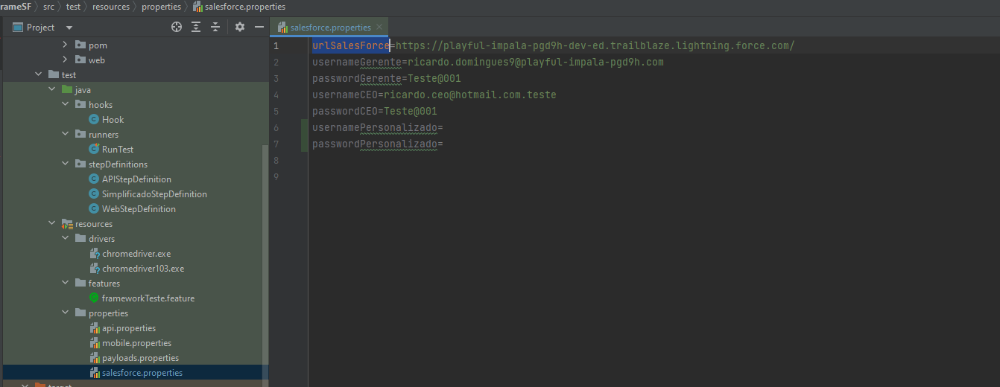
    

</h4>

#### Funções de navegação:

- <b>When Accesar o objeto "Casos" e mudar o modo de exibicao da lista para "Meus casos"</b> -> Acessa um app e muda a forma de visualização de Lista atraves do texto presente em tela;
<h4 align="center"> Exemplo de lista de visualização:
  

  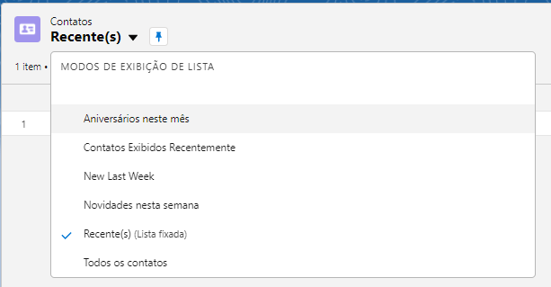
  

</h4>

- <b> When Accesar o objeto "Contas" e criar um novo registro </b> -> Acessa um app e clica no botão de criação de registro, esperando o input dos dados;

- <b> When acessar o registro "Andy Young" </b> -> Busca e entra em qualquer registro ja criado no Salesforce;
<h4 align="center"> Exemplo de busca de registro:
  

  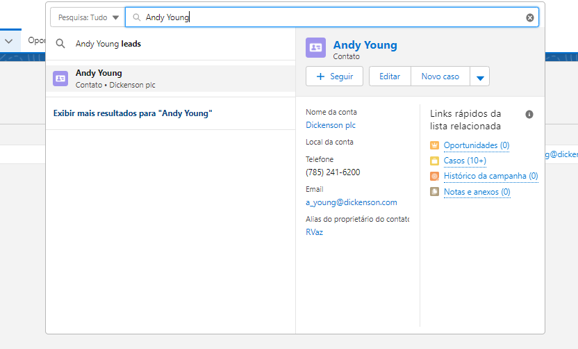

</h4>

#### Funções de preenchimento de inputs e checkbox:

- <b> And clicar no checkbox "Particular" </b> -> clica em um checkbox presente na tela atraves de seu texto;
- <b> And preencher o campo "Nome da oportunidade" com o valor "teste Random" </b> -> Identifica o tipo de campo de input (Texto, comboBox, Data, etc...) e preenche de acordo com o valor colocado. Qualquer valor que contenha a palavra "Random" vai ser randomizado em um hexadecimal de 5 caracteres;
<h4 align="center"> Exemplo de inputs:
  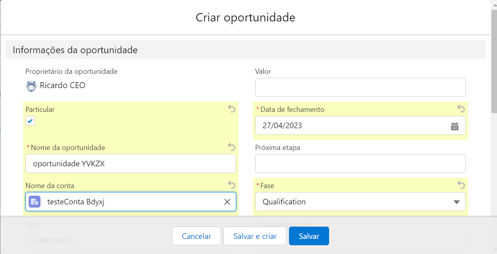
</h4>

- <b> And preencher o campo "Nome da oportunidade" com o valor da variavel "varNomeOportunidade" </b> -> Identifica o tipo de campo de input (Texto, comboBox, Data, etc...) e preenche de acordo com o valor de uma variavel coletada anteriormente, passando o nome da variavel. Qualquer valor que contenha a palavra "Random" vai ser randomizado em um hexadecimal de 5 caracteres;

- <b> And edite o campo "Departamento" com o valor "testeValor" </b> ->  clica para editar o campo atraves de seu texto em tela, depois identifica o tipo de input(Texto, comboBox, Data, etc...)  e preenche de acordo com o valor colocado. Qualquer valor que contenha a palavra "Random" vai ser randomizado em um hexadecimal de 5 caracteres;
- <b> And edite o campo "Telefone residencial" com o valor da variavel "varCelular" </b> ->  clica para editar o campo atraves de seu texto em tela, depois identifica o tipo de input(Texto, comboBox, Data, etc...) e preenche de acordo com o valor de uma variavel coletada anteriormente, passando o nome da variavel.

<h4 align="center"> Exemplo de edição:
  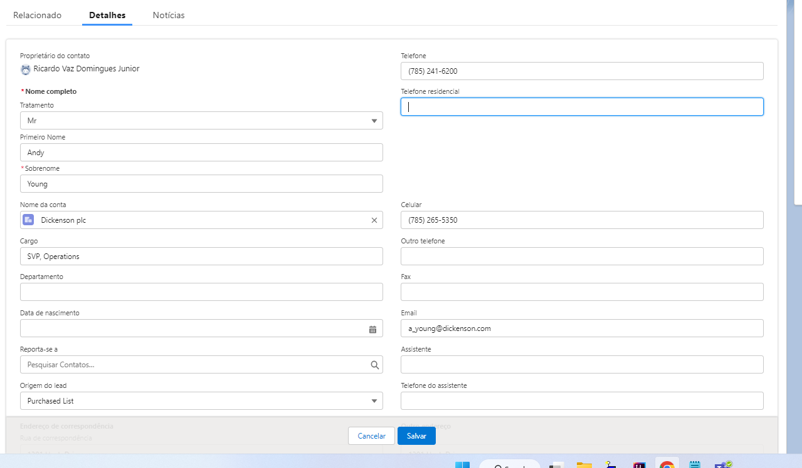
</h4>
    

#### Funções de salvamento de registros:

- <b> And Salvar a criacao do registro com sucesso </b> -> Salva o registro que estava em preenchimento e valida que o mesmo foi criado sem erros;
- <b> And Salvar a criacao do registro com falha </b> -> Salva o registro que estava em preenchimento e valida que um erro impediu a criação do registro;

#### Funções de validação de campos, valores e erros:

- <b>And busca pela mensagem de erro "Revise os seguintes campos"</b> -> Verifica se uma mensagem de erro foi apresentada na tela;
<h4 align="left"> Exemplo de mensagem de falha:
  

  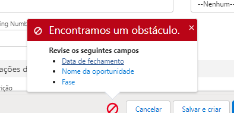
    

</h4>
- <b> Then espero que o campo "Nome completo" esteja com o valor "Mr Andy Young" | ou | Then espero que o campo "Celular" esteja com o valor "^(.*)$" </b>-> Valida que um campo do registro esteja preenchido com o valor definido, sendo esse valor podendo ser um regex ou valor completo;
<h4 align="left"> Exemplo de campos a ser validados:
  

  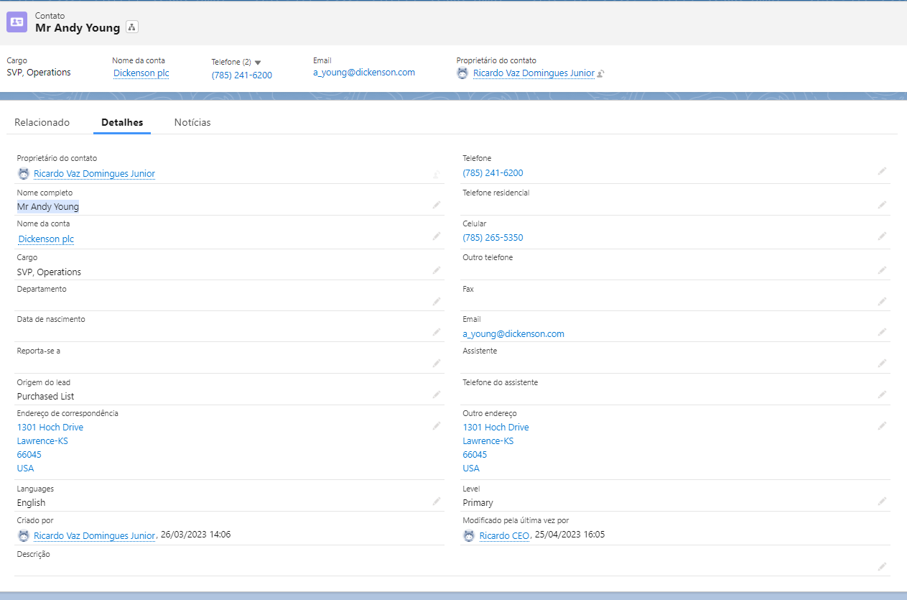
    

</h4>

#### Funções de captura de dados em variaveis:

 - <b> And capture o valor do campo "Celular" e armazene na variavel "varCelular" </b> -> Usa o valor preenchido de um campo e armazena em uma variavel para uso posterior;

### Funções Simplificadas e Personalizadas:

- <h4> Caso seu teste esteja ficando grande demais no gherkin, é possivel diminuir ele em apenas 1 step, usando as palavrar reservadas do gherkin a seguir:</h4>

- <b>And simplifique o teste de preenchimento </b>-> Simplifica o teste de preenchimento, pegando o objeto criado, os campos e valores preenchidos, e valida se no final é um teste negativo ou positivo de criação. Gera o codigo inteiro do teste no log, assim é possivel coleta-lo e criar um step personalizado.
<h4 align="left"> Exemplo de codigo gerado no log:
  

  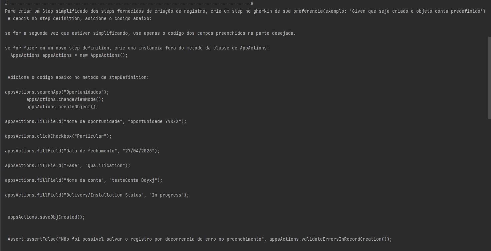
    

</h4>

- <b>And simplifique o teste de validacao </b>-> Simplifica o teste de validação, pegando o registro acessado, os campos e valores validados. Gera o codigo inteiro do teste no log, assim é possivel coleta-lo e criar um step personalizado.

- <b> após pegar seu codigo no log, vc pode criar um step personalizado com passos adicionais que não foi possivel fazer usando os steps pré definidos: </b>
<h4 align="left"> Exemplo de teste sem simplificar e simplificado:
  

  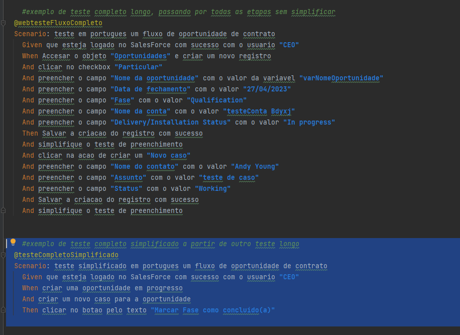
    

</h4>

<h4 align="left"> Exemplo de step personalizado:
  

  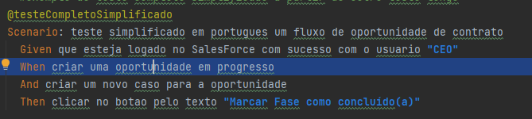
    

</h4>

<h4 align="left"> Codigo no step definition personalizado:
  

  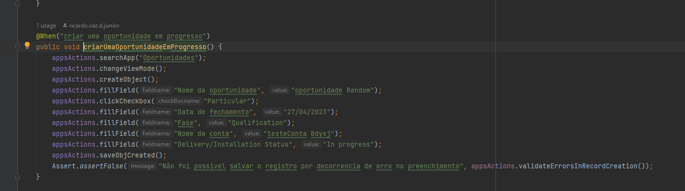
    

</h4>

### Personalizar Codigo para teste:
 
 
<b> Caso precise personalizar codigo para testar outras aplicações ou funções não cobertas pelo Framework, siga os passos abaixo para melhorar a eficacia dos seus testes personalizados: </b>

 
- <b> De acordo com a versão atual do seu Google Chrome, coloque o driver atualizado no diretorio: src/test/resources/drivers </b>
- <b> Assim que iniciado o driver, ele sera instanciado na classe "ConfigFramework" e será possivel acessa-lo em qualquer parte do codigo atraves do get getBrowser() , para isso, na classe voce precisa colocar extends ConfigFramework, assim como no exemplo abaixo: </b>
<h4 align="left"> Exemplo de uso do driver getBrowser:
  

  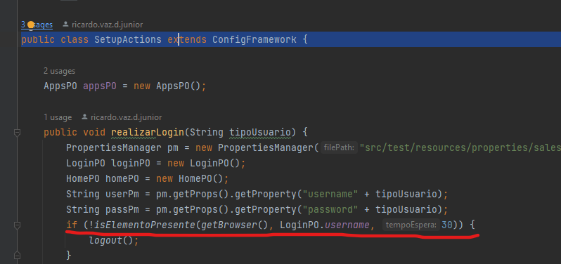
    

</h4>

- Crie seu arquivo <b>Page Objets</b> dentro do diretorio src/main/java/pom;
- Crie seu arquivo de <b>Actions</b> dentro do diretorio src/main/java/web;
- Crie seu arquivo de <b>Feature</b> dentro do diretorio src/test/resources/features;
- Crie seu arquivo de <b>StepDefinition</b> dentro do diretorio src/test/java/stepDefinitions;
- Para facilitar na navegação do Salesforce, voce pode usar os metodos estaticos de interação padrão do Selenium, colocados na classe: src/main/java/web/ActionUtils.java

<h4 align="left"> Hierarquia de diretorios da aba tests:
  

  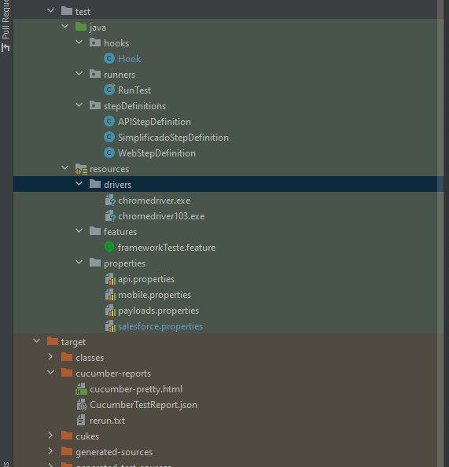
    

</h4>

## 🛠 Tecnologias

As seguintes ferramentas foram usadas na construção do projeto:

- [java](https://dev.java/)
- [Rest-Assured](https://rest-assured.io/)
- [OKHTTP](https://square.github.io/okhttp/)
- [Selenium](https://www.selenium.dev/)
- [Cucumber](https://cucumber.io/)
- [Extent-Reports](https://www.extentreports.com/)

## Autor
---

<h4 align="left">
  

  
    

</h4>
Feito com ❤️ por Ricardo Vaz 👋🏽 Entre em contato!

